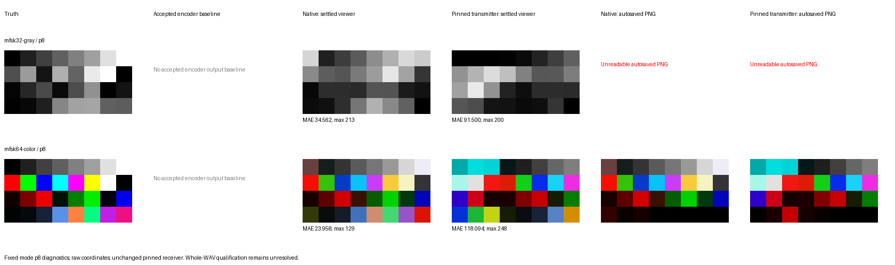
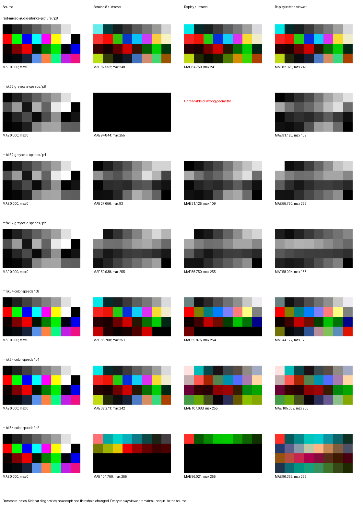

# Session 9 picture-path investigation

**Current PM scope — D-027:** qualify credible broadcasts using representative
large pictures, a reasonable numerical scorecard, the pinned Pi fldigi harness
and the accepted public GramPy decoder, followed by PM visual review. Tiny-image
diagnosis and fresh fldigi TX calibration are deferred. The separately frozen
[v3 matrix](../mfsk_encoder_pi_matrix_v3.json) and
[practical qualification record](practical-qualification.md) govern the new run.
The preceding investigative proposals and failures below remain historical
evidence; they no longer define prerequisites for practical qualification.

**Current result, 2026-10-03:** practical qualification is accepted. PM has
viewed and accepted all images. The original ten-case numerical run is retained;
the separate D-028 decoder correction recovers the three previously skipped
MFSK32 pictures, so all ten cases now pass in both decoders. The encoder remains
unchanged. [Acceptance and scope](practical-acceptance.json),
[original review](practical-review/index.html) and
[MFSK32 correction review](../../../decoder/data/auto-mfsk32-pictures/index.html)
retain the evidence. Visible blur and other reviewed limits are accepted for
this practical scope.

For the distinction between failed qualification and the successful manual
picture, start with [the current explanation](qualification-explained.md).
It identifies the producer of each WAV and the different test conditions.

**Earlier user direction (superseded closeout sequence):** replace decoded-picture bit perfection with sensible
scorecard-based qualification, while diagnosing severe tiny-picture failures
independently. The replacement principle is confirmed; numerical limits need
reference calibration before application. Exact encoder waveform/protocol
checks and original failed manifests remain. [The concrete qualification
proposal](qualification-proposal.md) includes ranked hypotheses, discriminating
tests and the bounded closeout sequence.

The accepted-picture-settings rerun completed successfully for all seven
original tiny and three large pictures; [its scorecard](accepted-scorecard.json)
supersedes the earlier low-level defaults as the basis for quality discussion,
but remains a coupled diagnostic. A 44-second native control WAV is ready with
original/constant/tall/wide p8 images. Source-derived model predictions show
that increasing duration alone retains distortion, while increasing horizontal
spacing sharply reduces it. These are model results, with live validation
pending. [Controls, predictions and limitations](qualification-proposal.md)
retain all original fixtures and production hashes.

[Filtering and the Mac/Pi comparison](filtering-and-receive-paths.md) explains
the audio-stage mechanism and retains both agreement and differences: native
large p8 is very close across paths, the slanted recorded control fails similarly,
the corrected control differs numerically, and tiny outputs differ while both
fail substantially. Builds, audio paths and completed-versus-saved evidence
confound attributing those differences to automation alone.

**Status (2026-10-02): both decoders differ from source pixels at every measured
speed and size; tiny fixtures have higher differing-pixel percentages. Reference
round-trip calibration remains open. The candidate remains unqualified.** No production encoder, decoder, fixture,
or acceptance criterion has changed. Session 8 artifacts and scores are retained.

**PM review:** before choosing receiver changes or a qualification disposition,
establish a fresh, repeatable fldigi-to-fldigi path with representative image
sizes and validate the capture/playback/collection harness. The completed paired
controls used archived transmissions of two 8×4 images, not fresh same-build
round trips of broadcast-sized pictures. See [the calibration sequence and
limits](roundtrip-calibration.md). The earlier remediation recommendation below
is provisional and superseded as the immediate next step; its observations remain.

[Fresh normal-sized control WAVs](manual-control.md) were independently decoded
by the user on the Mac. The exact fldigi WAV was also replayed on the Pi with
fixed mode/carrier, no RxID/AFC, and historical five-second polling. This puts
manual receive-path calibration ahead of further receiver-remediation analysis.

The first fresh same-build Pi round trip completed: text and 160×120 dimensions
pass, but the chart is visibly slanted. Autosave equals the completed widget in
this run, so saving does not account for its distortion. On the Mac, fldigi
4.2.11 recovers a visually clean native picture and substantially the same slant
from the reference WAV. A waveform diagnostic finds approximately 0.186%
longer image periods in that control. Uniformly correcting its time scale
removes the Pi slant and reduces source MAE from 69.660 to 2.706 without receive
changes. This establishes the original WAV's timing error as the cause of the
slant; its source within generation/capture remains unresolved. Two fresh
capture experiments failed and are retained. The corrected derivative is a
diagnostic, not a qualified reference; the fresh reference path remains open.

The user confirmed the corrected reference's Mac picture is straight. More
directly, the exact unchanged native WAV now also recovers a clean chart through
the pinned Pi receive harness, including text, dimensions and matching saved/
completed images. The native Pi/Mac pictures are close (component MAE 1.166),
while both still fail source-pixel equality. This shifts the immediate question
to the original tiny fixtures and their collection/scoring conditions. Compare
an original failed native WAV on the Mac next, before further transmit-capture
repair. The clean native control does not cover faster speeds or automatic RxID.

The user subsequently returned all three original RGB tiny-picture Mac saves.
They also have substantial source differences at p8/p4/p2, so a Pi-only fault
cannot explain the saved-image failures. See [the independent comparison](mac-tiny-comparison.md).
Completed Mac buffers were not captured. The user has now returned the 160×120
p4/p2 controls, and GramPy's unchanged picture decoder has also processed the
same native p8/p4/p2 WAVs. All differ from source pixels, including the clean p8
chart. Tiny fixtures have higher differing-pixel percentages in both paths;
GramPy's coupled direct-WAV results have smaller mean errors, and both paths'
normal-sized mean errors increase at p2. See [the comparison, exact metrics and
method limits](decoder-comparison.md). These findings do not identify a single
shared cause or justify a production change or acceptance relaxation.

A follow-up magnitude/alignment check explains why the normal-sized Mac images
can look good despite 86–91% exact pixel mismatches: the median pixel's largest
channel difference is only 2/4/8 levels out of 255 at p8/p4/p2. Small horizontal
misregistration substantially contributes to sharp-edge errors at p8/p4.
[The distributions and method](decoder-comparison.md) are retained alongside
the original unadjusted counts; no visual-quality threshold is inferred.

## Findings established locally

[Local waveform measurements](local-waveform.json) cover every failed Session 8
picture. An independent recipe constructs the documented 44 ms low-frequency
prologue, source-derived grayscale or row/R/G/B component order, p8/p4/p2
duration, frequency map, and continuous phase. Two fitted quadratures permit
an arbitrary initial oscillator phase; all subsequent phase advances are fixed
by that recipe. Raster coordinates are derived from the retained public
next-content timestamp, frozen post-picture flush count, and component count.
They agree with the planner coordinates, which are used separately for the
coupled decoder diagnostic.

Every measured prologue/raster fits this recipe with maximum residual below
0.55 signed-PCM units and RMS residual 0.276–0.292, consistent with PCM16
rounding. Frequency +20 Hz, reversed component order, and a one-output-frame
component-boundary mutation produce RMS errors of at least 11,317, 4,767, and
129 units respectively. This supports the existing raster waveform for these
seven retained WAV intervals; it is not universal encoder qualification or a
measurement of the live receiver transport.

GramPy's default picture decoder finds boundaries within four 48-kHz frames,
but still changes pixel values. Giving its component estimator the exact
boundary does not eliminate the errors. Real-to-analytic conversion and
short-window frequency estimation therefore contribute to the coupled local
diagnostic errors. A decoder error alone does not identify an encoder defect.

| Failed picture | PCM model RMS, signed-PCM units | GramPy default pixel MAE | GramPy estimator at exact boundary MAE | Source-derived fldigi filter model best-offset MAE |
| --- | ---: | ---: | ---: | ---: |
| Mixed composition, MFSK64 RGB p8 | 0.290 | 1.781 | 1.750 | 15.240 |
| MFSK32 grayscale p8 | 0.280 | 1.281 | 1.469 | 26.406 |
| MFSK32 grayscale p4 | 0.279 | 4.344 | 4.094 | 43.250 |
| MFSK32 grayscale p2 | 0.292 | 15.344 | 10.656 | 51.000 |
| MFSK64 RGB p8 | 0.280 | 1.250 | 1.479 | 15.313 |
| MFSK64 RGB p4 | 0.285 | 3.677 | 3.677 | 42.792 |
| MFSK64 RGB p2 | 0.276 | 14.250 | 14.760 | 59.333 |

The last column is **simulation, not observed fldigi reception**. The
[filter model](filter-model.json) reproduces the pinned receiver's 37-tap
Hilbert and 127-tap bandpass formulas, mixer, and phase-difference component
estimator from [the retained source excerpt](filter-source.log). It includes
the extra one-sample delay in each `C_FIR_filter::run` call. The combined
group delay is 83 internal 8-kHz samples (10.375 ms). A truth-selected offset
search from -128 through +256 internal samples finds its best fit at 82 or 83;
even this favorable alignment retains large component errors. Six steady-tone
checks at values 0, 128, and 255 in both bandwidths recover within 0.01 intensity
units. This verifies the model's basic sign, mixing, and scale.

The model bypasses ALSA and the live receiver resampler, text-trigger latency,
receiver tuning errors, the first-pixel `prevz` state, and GUI/save concurrency.
It demonstrates that the receiver filters can distort these short components.
The paired experiment below separately tests the live receiver behavior.

## Paired receiver experiment: observed results

[session9_probe.py](../../../../experiments/mfsk-wav-encoder/session9_probe.py)
and [the managed Pi workflow](../../../../tools/pi-investigate-mfsk-pictures.sh)
performed four paired p8 runs: pinned-transmitter and native-candidate MFSK32
grayscale, then pinned-transmitter and native-candidate MFSK64 RGB.

The candidate uses the unchanged Session 8 wheel. The reference uses retained,
hash-verified pinned-transmitter fixtures; decoded source PPM and PNG pixels
must be identical. Both transmitters receive under the same fixed-mode,
1500-Hz, AFC-off, RxID-off, fresh-configuration settings. These are diagnostic
fixed-mode runs and cannot replace whole-WAV RxID acceptance.

A sidecar copy of the adapter leaves the pinned receiver binary unchanged and
reads its picture widget buffer with gdb after playback and the normal
15-second settling interval, before shutdown. It invokes no receiver function
and does not alter receiver variables. The original autosave, settled buffer,
logs, configuration, input WAVs, source identities, and pixel scores are retained.
The snapshot does not pause the receiver during playback. The first attempt
stopped at reporting an unreadable grayscale autosave. The reporter was
corrected to retain that failure, and resumed using the completed reception;
the unchanged input and receiver identities were checked before resumption.
See the [initial result](paired-attempt1-result.md),
[completed result](paired-result.md), [identity](paired-identity.json), and
[all pixel values and scores](paired-results.json).

| p8 transmission | Autosaved image | Settled widget source MAE | Maximum component error |
| --- | --- | ---: | ---: |
| Pinned transmitter, MFSK32 grayscale | Unreadable PNG, 143 bytes; header 136×104 | 91.500 | 200 |
| Native candidate, MFSK32 grayscale | Unreadable PNG, 143 bytes; header 136×104 | 34.563 | 213 |
| Pinned transmitter, MFSK64 RGB | Readable 8×4; differs from widget | 118.094 | 248 |
| Native candidate, MFSK64 RGB | Readable 8×4; differs from widget | 23.958 | 129 |

Every autosave differs from its settled buffer. Every settled buffer also
differs substantially from the source. The pinned transmitter therefore fails
the same source-pixel gate. These errors are not an accepted reference baseline
or a justification for tolerating the native result.



Three receiver findings explain distinct parts of these observations:

1. **Saving precedes queued updates.** `mfsk::rx_process` queues viewer resize
   and pixel updates through `REQ`, but calls `picRx->save_png` directly from
   reception. The unreadable grayscale headers still contain the initial
   136×104 geometry; settled widgets are 8×4. For RGB, a readable autosave
   nevertheless misses updates present in the settled buffer. This establishes
   that autosaves are unreliable measurement artifacts in these runs.
2. **Filtering and effective timing distort interior pixels.** The
   [source-derived model fit](paired-timing.json) reproduces the pinned
   transmitter's interior received components exactly, and the native
   interior components with MAE 0.067 (gray) and 0.223 (RGB). It fits a
   resampling phase and offset to the received buffer, excluding the first
   and last components. Relative to the 83-sample filter delay, offsets are
   -29/-23 samples for pinned gray/RGB and +1/-3 for native gray/RGB. These
   are explanatory, viewer-selected fits; they neither measure exact live
   trigger time nor establish acceptance. Filter transients remain even with
   favorable source-selected alignment.
3. **The final component is never emitted.** After initializing `counter`
   to `picturesize`, `rx_process` decrements it before `recvpic`. At zero it
   saves and resets instead of processing that sample. `recvpic` emits at
   multiples of `RXspp`, so only K−1 components are emitted. The last source
   grayscale value is 93 and the last source blue value is 129; all four
   settled buffers retain zero there. This alone prevents exact source-pixel
   equality with this receiver and these fixtures, regardless of transmitter
   raster quality.

The first component has a separate state concern: `picf`/`prevz` are not reset
at picture entry. It is excluded from the timing fit rather than explained
away. Live tuning, resampling, and header-trigger state can change effective
alignment and remain outside the filter-only model.

## Original whole-WAV follow-up

[session9_wholewav.py](../../../../experiments/mfsk-wav-encoder/session9_wholewav.py)
replays the three original failed WAVs with their original starting
configurations, BPSK31 start, RxID on, AFC off, continuous playback, and no
manual mode changes. All seven contractual picture combinations remain in
the check. WAV and receiver hashes are verified.

A first attempt stopped before playback because the remote archive had not
been unpacked. A second attempt rejected X11 screen sampling because the
painted pixels did not equal the final widget buffer. Source inspection shows
`picture::pixel` requests redraw only at a row's first component; a painted
screen is therefore not a reliable substitute for the complete buffer.
Both attempts are retained in `.local/session9/`.

The completed corrected sidecar reads stable widget bytes through read-only process
memory, using layout offsets from the pinned binary's own debug symbols.
It does not stop reception or call receiver functions. Its final capture
must equal an independent post-playback gdb dump before results are used.
All three runs completed in 224 seconds. Each final live sample equals its
independent gdb dump, and the caller text and image announcements are recovered
in order. See [the authoritative result](wholewav-result.md),
[identity](wholewav-identity.json), [seven raw buffers](wholewav-results.json),
[text checks](wholewav-text.json), and
[comparison/model results](wholewav-comparison.json).

The replay remains diagnostic: replacing the qualification collector has
not been confirmed, and no source-pixel threshold has changed.

| Whole-WAV picture | Settled source MAE | Maximum error | Model interior MAE | Fitted offset from filter delay, internal samples |
| --- | ---: | ---: | ---: | ---: |
| Mixed MFSK64 RGB p8 | 82.323 | 241 | 0.298 | -9 |
| MFSK32 grayscale p8 | 31.125 | 109 | 0.533 | -3 |
| MFSK32 grayscale p4 | 55.750 | 255 | 0.633 | -3 |
| MFSK32 grayscale p2 | 58.094 | 158 | 0.600 | -3 |
| MFSK64 RGB p8 | 44.177 | 129 | 0.234 | -4 |
| MFSK64 RGB p4 | 105.063 | 255 | 0.330 | -8 |
| MFSK64 RGB p2 | 96.365 | 255 | 0.564 | -12 |

Every settled image still fails source pixels, and every autosave differs
from its contemporaneous settled buffer. Model fits exclude the first and
last component and use receiver-selected timing; all six resampling phases
and offsets -128 through +768 are searched. The greatest interior component
residual is three intensity units. This strong reproduction identifies the
receiver filtering/effective timing contribution without making the fitted
model an independent acceptance oracle. All seven last components retain zero.



## Minimal explanation of each failed qualification case

- **Mixed audio/silence/MFSK32/MFSK64/RGB p8:** the raster matches the independent
  wire recipe. Acquisition and ordered text passed in Session 8 and caller text
  still passes in this replay. The settled picture's interior is reproduced by
  receiver filtering with an effective offset nine samples before group-delay
  compensation; the source row/R/G/B planes therefore appear displaced at
  reception. Its autosave misses later widget updates, and the receiver omits
  the final blue component. No raster frequency/order/duration defect is found.
- **MFSK32 grayscale p8/p4/p2:** all three rasters match. The p8 replay autosave
  is unreadable, but its completed buffer contains an image. The p4 autosave's
  pixel hash is exactly the preceding p8 buffer's hash, and the p2 autosave is
  exactly the preceding p4 buffer. Thus a saved artifact can report the wrong
  picture speed's buffer. Genuine p8/p4/p2 interiors match the narrow-filter
  model at a common offset of -3 samples from group delay, with greater source
  distortion at faster speeds. Every final grayscale component is omitted.
- **MFSK64 RGB p8/p4/p2:** all row/R/G/B rasters match. Each saved image misses
  updates present in its own settled buffer. Filtering plus effective offsets
  of -4/-8/-12 samples explain the settled p8/p4/p2 interiors, including apparent
  plane/row shifts. Each final blue component is omitted. Altering native
  raster order or appending a pixel would hide receiver behavior and change the
  accepted wire profile without a supported correction.

GramPy's smaller errors remain an estimator limitation demonstrated by
exact-boundary diagnostics; they are not independent evidence that an encoder
change is necessary. The first received component and exact live trigger/
resampler/tuning contribution are not fully decomposed. Those limits do not
erase the demonstrated save and final-component faults or the modeled interiors.

## Provisional recommendation

D-025 records **investigation only**: retain the source-compatible native
raster, correct receiver artifact collection and establish a usable reference gate, then
recommend the smallest supported correction. There is currently no evidence
justifying a production frequency-map, raster-order, pixel-duration, or
prologue-length change. Do not insert a gap, resize the fixture, relax pixel
checks, or patch the decoder to turn a coupled round trip into acceptance.

Both comparisons support no encoder correction. A useful next change
must first repair the qualification collector and resolve the receiver's
missing component, initial state, and filtering/timing limitations. Repairing
autosaves alone will not make source pixels exact. Retaining an unchanged
receiver while adding padding, changing native timing, shrinking the fixture,
or weakening the pixel criterion would change the approved compatibility or
evidence decision without establishing fidelity.

The recommended product disposition is **defer encoder qualification pending
receiver/reference remediation**, retaining the current failed Session 8
qualification. A bounded follow-up should (1) collect the completed picture
buffer, (2) resolve receiver final-component and picture-entry state, and
(3) establish independently qualified pinned-transmitter controls for all
p8/p4/p2 combinations before proposing any fidelity rule. An instrumented or
patched receiver must receive a new explicit identity and qualification;
it cannot silently replace D-009's pinned reference. The current evidence
cannot promise exact source pixels after lifecycle fixes because filter
transients alone already alter those pixels.

Any measurement correction or changed reference/fidelity/acceptance decision
must be explicitly recorded and confirmed before affected production work.
Session 9 remains open; it has not reached its qualify/reject/defer closeout.

## Reproduction and retained evidence

Run the local scripts through `tools/mac-local.sh` with the repository virtualenv:

```sh
.venv/bin/python experiments/mfsk-wav-encoder/session9_local.py \
  .local/session8/evidence .local/session9/local
.venv/bin/python experiments/mfsk-wav-encoder/session9_filter_model.py \
  .local/session8/evidence .local/session9/local/local-waveform.json \
  .local/session9/local/filter-model.json
```

Authoritative completed records: [local measurement](local-result.md),
[pinned-source inspection](filter-source-result.md), and
[filter-model calibration](filter-model-result.md), plus
[paired model fitting](paired-timing-result.md),
[paired visual review](paired-review-result.md), and
[whole-WAV review/text verification](wholewav-review-result.md). Full local
and remote reception artifacts, source snapshots, unsuccessful attempts,
prototype scripts, and transfer bundles remain in `.local/session9/`. Pi targets and
transport details remain in `.local/`; no commit was created.

[Final evidence verification](verification.json) confirms seven-case coverage,
six steady-tone calibration cases, compiled experiment scripts, paired/whole-WAV
identity and buffer checks, valid evidence links, and unchanged hashes for all
40 retained production files. Its
[authoritative managed result](verify-result.md) is preserved. A broad product
regression was not rerun because no production behavior changed; these new
sidecar measurements have their own waveform mutation and calibration checks.
