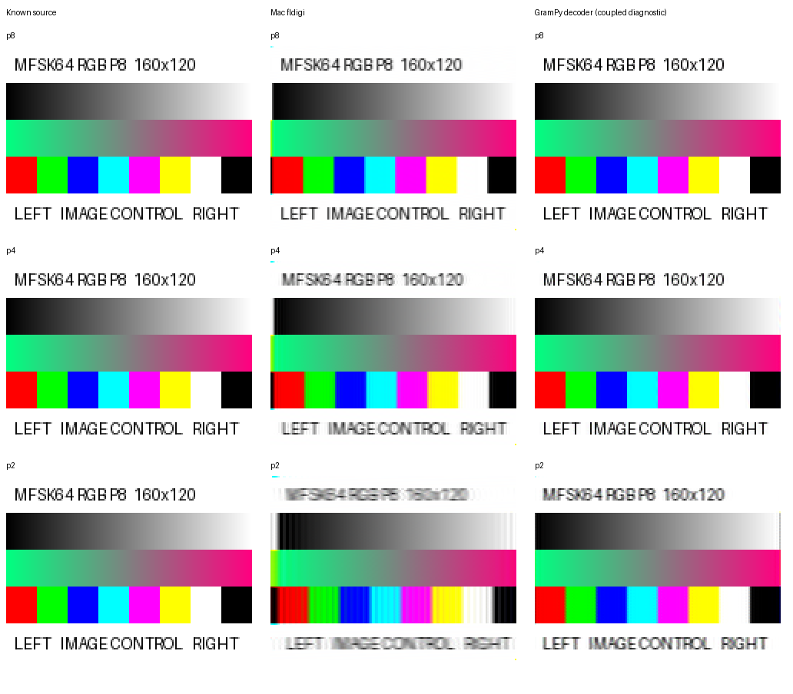

# Native WAVs decoded by Mac fldigi and GramPy

**New evidence:** the low-level defaults and percentages below are retained
historical diagnostics. The [accepted-picture-settings scorecard](accepted-scorecard.json)
and [current qualification proposal](qualification-proposal.md) now provide the
quality comparison and tiny-picture hypothesis tests. They still do not
constitute independent whole-WAV encoder qualification.

**Interpretation checkpoint:** possible revision of decoded-picture loopback
acceptance and severe tiny-picture distortion are separate issues. The decoder's
existing scorecard framework should inform any future quality proposal; exact
mismatch percentages alone do not make that policy decision. See
[the user's direction and existing framework](acceptance-and-tiny-images.md).

**2026-10-02 finding:** every measured image differs from its source pixels,
including the visually clean 160×120 p8 chart. The original 8×4 fixtures have
a higher percentage of differing pixels at every speed in both decoder paths.
GramPy's diagnostic results have smaller average errors than the supplied Mac
fldigi saves. The outputs do not have identical distortion.

The user supplied the normal-sized p4/p2 PNGs and recovered text with the correct
`Pic:160x120Cp4;` / `Pic:160x120Cp2;` announcements, caller labels and end labels.
The chart itself still reads P8 because all three speeds transmit the identical
source image. The garbled text preceding STX has not been separately diagnosed.

## Percentage and magnitude are different measurements

A differing pixel means **any** R, G or B value differs at the same coordinate,
even by one. These are exact pixel comparisons, not digital bit-error rates or
an image-usability threshold. Each tiny image has 32 pixels; each large image
has 19,200. Comparisons do not realign or smooth the received images.

| Speed | GramPy 8×4 differing pixels | GramPy 160×120 differing pixels | Mac fldigi 8×4 differing pixels | Mac fldigi 160×120 differing pixels |
| --- | ---: | ---: | ---: | ---: |
| p8 | 90.6% | 7.6% | 100.0% | 86.6% |
| p4 | 93.8% | 17.6% | 100.0% | 90.9% |
| p2 | 100.0% | 23.0% | 96.9% | 90.0% |

Mean absolute component error averages the absolute R/G/B differences on the
0–255 value scale. It describes how large the differences are, whereas the
percentage above describes how widespread they are.

| Speed | GramPy 8×4 mean error | GramPy 160×120 mean error | Mac fldigi 8×4 mean error | Mac fldigi 160×120 mean error |
| --- | ---: | ---: | ---: | ---: |
| p8 | 1.250 | 0.386 | 87.802 | 13.697 |
| p4 | 3.677 | 0.694 | 113.177 | 16.214 |
| p2 | 14.250 | 5.890 | 97.771 | 22.059 |

All six native GramPy results and six Mac saves compared here fail exact
source-pixel equality. GramPy's tiny p8 picture illustrates why a high differing
pixel percentage need not mean severe distortion: 90.6% of pixels differ, but
the average component error is only 1.250. At normal size, both decoders show
greater average error as picture speed increases from p8 to p4 to p2.

Counting differing **components** instead gives another percentage; it must not
be called the differing-pixel percentage. For example, Mac p2 has 70.8% differing
tiny-image components versus 72.8% large-image components, despite its higher
tiny-image differing-pixel percentage and much larger mean error.

### Why 86–91% differing pixels can still look good

The strict mismatch count is correct but is insufficient to describe visible
damage. A follow-up [error-distribution measurement](pixel-difference-detail.json)
uses the same source and Mac PNG hashes and measures each pixel's largest
R/G/B difference. The median of those largest differences is 2/4/8 levels out
of 255 at p8/p4/p2. At p8, 87.9% of pixels have every channel within five levels
of the source; at p4, 82.6% do. At p2, 73.1% are within ten levels. These are
descriptive distributions, not proposed passing tolerances.

For example, source red `[255,0,0]` at (10,82) becomes `[254,0,0]` in the p8
save, and gray `[128,128,128]` at (80,30) becomes `[126,126,126]`. Both count as
different pixels even though the changes are small. Some errors are much larger,
particularly around text and colour boundaries; the mean alone does not describe
their distribution either.

A translation-only diagnostic compares offsets of -3 to +3 pixels using the
same fixed interior source crop for every offset. Comparing source pixel (x,y)
with received pixel (x+1,y) reduces p8 cropped mean error from 14.573 to 4.705;
the best p4 offset is two horizontal pixels, reducing 16.860 to 7.407. The p2
search's best offset lies at its three-pixel limit, so it does not establish
the optimum there. This supports small horizontal misregistration as a major
contribution to raw same-coordinate error at sharp edges; its origin is not
isolated. The p8 exact-mismatch percentage barely changes after alignment,
because small value differences remain widespread. The original measurements
and qualification scores are retained without adjustment.

The managed follow-up [completed successfully](pixel-difference-detail-result.md).
The percentage should therefore be reported as an exact mismatch count alongside
the magnitude and alignment evidence, rather than presented alone as image
damage or a decoder-quality ranking.

## Evidence and method limits

The Mac saves come from fldigi 4.2.11. The retained p8 save is
`pic_2026-10-02_160810z.png`; the new p4/p2 files are
`pic_2026-10-02_205008z.png` and `pic_2026-10-02_205111z.png`.
These are saved-file measurements; completed Mac widget buffers were not captured.
Copies and hashes are retained alongside the source and GramPy outputs in
`decoder-comparison/` and [the measurement record](decoder-comparison.json).

GramPy uses the existing, unchanged picture decoder on the exact native WAVs.
This is a **coupled direct-WAV diagnostic**, with known segment start, MFSK64
mode and 1500 Hz carrier. PCM is converted to analytic samples with a Hilbert
transform; the existing text decoder recovers the picture header. The picture
decoder then uses its normal boundary prediction and component defaults. No
exact raster boundary or source pixel values are supplied to the estimator.
Its selected integer raster boundary differs from the planner by 0/1/1 input
frames at p8/p4/p2. All pictures complete with 57,600 components.

The large-picture path uses `current_wide` filtering, `fft_peak` estimation and
`center_crop` windows with the default 4096-component inline limit. The retained
tiny diagnostic uses the inline path without that large-picture filter. Known
mode/start, analytic conversion and the size-dependent decoder path prevent
these figures from being an independent blind IQ reception qualification or
a controlled test of image size alone. The tiny fixture and large chart also
have different content. No comparative decoder-quality ranking is qualified.
These low-level defaults also differ from the accepted decoder configuration
(`response_matched`, `bounded_correlation`, `full_hann`); this is not a production
decoder scorecard comparison.

The decoding job [completed successfully in five seconds](decoder-comparison-result.md)
and verified all 40 retained production-file hashes. The compact summary job
[completed successfully in one second](decoder-comparison-summary-result.md).
Full per-case boundary diagnostics, component NPZs, scripts and logs remain
under `.local/session9/decoder-comparison/` and `.local/session9/`.

## Confidence, remediation and PM position

**High confidence:** all measured images are non-exact; tiny fixtures have higher
differing-pixel percentages in both paths; GramPy's measured errors are smaller
in magnitude; normal-sized p2 degrades more visibly than p8/p4. Independent Mac
failures continue to exclude a Pi-only receive harness fault as the sole cause.

**Still unresolved:** the contribution of each receive filter, estimator,
alignment and save path; normal fldigi reference loss from a repeatable fresh
transmitter capture; general behavior across grayscale, both modes and RxID.
The independent native waveform checks have found no raster recipe/timing
defect in the retained qualification cases. A saved-pixel mismatch alone does
not identify an encoder defect or imply that both receivers share one cause.

No production remediation follows from these descriptive figures. Keep the
original exact-pixel failures and useful-image evidence together, continue
reference-path calibration before choosing a fidelity criterion or production
correction, and retain the separate fldigi-recording timing investigation.
D-025 is updated; no new PM production decision is requested at this checkpoint.
