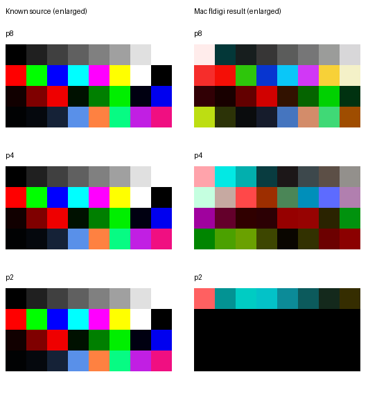

# Independent Mac replay of original tiny-image qualification WAV

The user returned three saved PNGs after the supplied original MFSK64 RGB
qualification WAV. In transmission/attachment order they correspond to p8,
p4 and p2. All are readable 8×4 RGB images; comments identify Mac fldigi 4.2.11
in MFSK-64. The source and input WAV identities, original PNGs, comments,
comparisons and managed records are retained. Mode/carrier settings, text recovery
and the completed Mac picture buffer were not independently captured.

| Speed | Mac source component MAE | Original Pi autosave MAE | Completed Pi replay MAE |
| --- | ---: | ---: | ---: |
| p8 | 87.802 | 85.708 | 44.177 |
| p4 | 113.177 | 82.271 | 105.063 |
| p2 | 97.771 | 101.750 | 96.365 |

All three Mac files have substantial color/content changes, not merely tiny
numeric errors in otherwise faithful images. The p2 save is predominantly black.
The Mac results are not pixel-identical to the Pi results. All retain a zero
final blue component, where the source's final blue is 129. That agrees with the
earlier receiver observation but does not explain the whole distortion.

The [four-column comparison](mac-tiny-comparison.png) additionally shows original
Pi saves and completed Pi replay buffers. [Detailed measurements](mac-tiny-summary.json)
and [the authoritative managed result](mac-tiny-review-result.md) retain the
differences, image provenance and limitations.

**High confidence:** the failed tiny-image saved outputs also occur on an
independent Mac path. A fault unique to Pi automation, SSH, polling or ALSA
cannot be the sole explanation. The normal-sized native p8 picture was useful
on both Mac and Pi, while these tiny native pictures are substantially distorted
on both. This reconciles useful native interoperability with failed original
qualification; it does not establish that all encoder profiles work correctly.

**Unresolved:** distinguish tiny-picture filtering/acquisition effects, shared
fldigi saving behavior and any encoder/profile issue. Saved Mac PNGs do not
establish the completed viewer's contents. The Pi replay already showed that
some saved artifacts differed from completed buffers, which also differed from
the source. The independent waveform recipe checks found no native raster
frequency/order/duration defect in these retained cases. No production encoder
or receiver correction is justified by the new saved-file comparison alone.

The same known 160×120 native chart has now been received at p4 and p2. Along
with the retained p8 result and GramPy's coupled diagnostic, [the comparison](decoder-comparison.md)
shows that every measured image fails exact pixels, while tiny fixtures have
higher differing-pixel percentages in both paths. The controls add evidence
about speed and size without depending on the failed fldigi transmitter capture;
different content and receive paths prevent attributing all differences to size
alone. The original 8×4 fixture, failures and exact-pixel rules remain.

| Additional unchanged-native control | Duration |
| --- | ---: |
| [160×120 RGB p4 WAV](/Users/sam/vcs/GramPy/.local/session9/mac-control/speed-controls/grampy-mfsk64-rgb-p4-160x120.wav) | 43.85575 seconds |
| [160×120 RGB p2 WAV](/Users/sam/vcs/GramPy/.local/session9/mac-control/speed-controls/grampy-mfsk64-rgb-p2-160x120.wav) | 29.45575 seconds |

Both use MFSK64 at 1500 Hz and the exact same 160×120 PNG as the clean p8
control. Use the same known manual playback method, with AFC/RxID off and
complete playback from the beginning. Caller labels identify p4 or p2. Source/
audio hashes and durations are in [the manifest](normal-sized-speed-controls.json).
The [managed generation result](normal-sized-speed-controls-result.md) reports
exit zero after three seconds and verifies all 40 retained production hashes.
