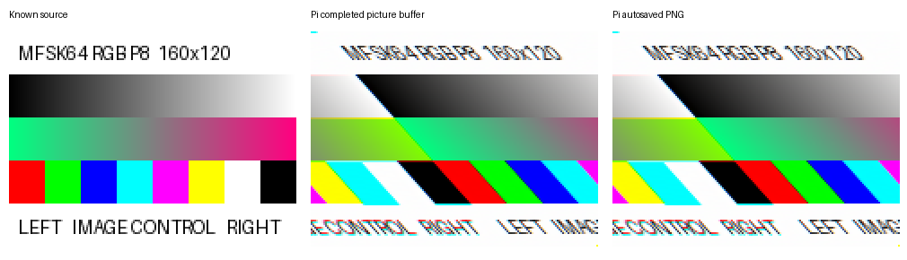
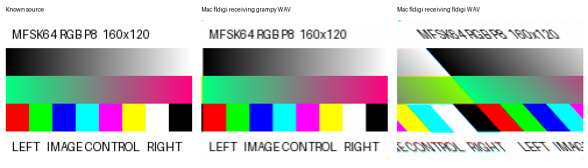
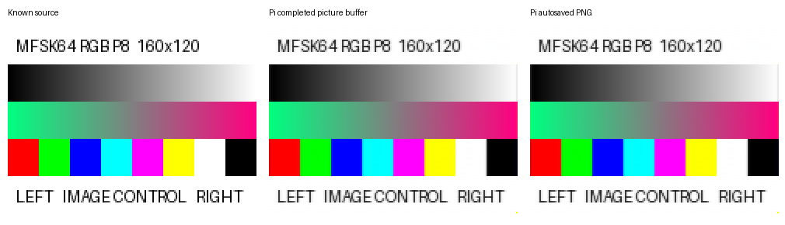
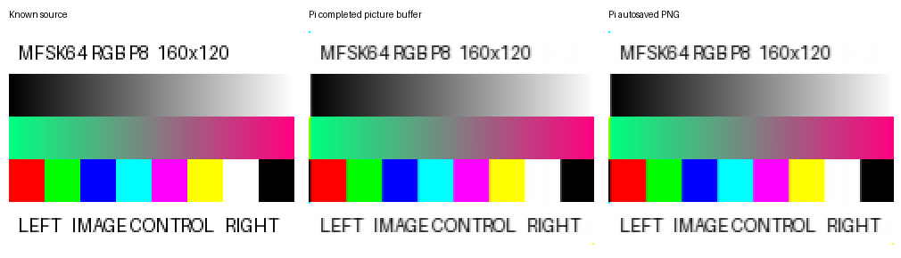

# Normal-sized picture controls for manual Mac decoding

**2026-10-02:** the user's independent Mac decode recovered a visually clean
GramPy picture and a severely slanted fldigi control. The exact fldigi WAV also
produced comparable slant on the Pi, recovering text and dimensions.
This is reference calibration, not an encoder qualification decision.
The user also confirmed a visually corrected image from the timing-corrected
fldigi diagnostic. That waveform is derived from the fldigi recording; the
native GramPy waveform never received a timing correction. See
[the qualification explanation](qualification-explained.md) for the distinction
between a useful manual picture and the original failed pixel checks.
The exact native WAV has now also produced a visually clean chart through the
unchanged pinned Pi receiving path; see the direct native comparison below.

Both WAVs carry the same newly generated 160×120 RGB chart at p8, with an audio
carrier of 1500 Hz in MFSK64. The unchanged pinned fldigi 4.2.13 build generated
the reference WAV. The unchanged native encoder generated the comparison WAV.
These additional controls leave the frozen 8×4 cases and acceptance rules intact.

| File | Transmitter | Duration |
| --- | --- | ---: |
| [fldigi control WAV](/Users/sam/vcs/GramPy/.local/session9/mac-control/fldigi-mfsk64-rgb-p8.wav) | Pinned fldigi 4.2.13 | 82.004 seconds |
| [GramPy comparison WAV](/Users/sam/vcs/GramPy/.local/session9/mac-control/grampy-mfsk64-rgb-p8.wav) | Current unchanged native encoder | 72.87975 seconds |
| [Known source image](/Users/sam/vcs/GramPy/.local/session9/mac-control/source-160x120.png) | Independently drawn RGB chart | 160×120 pixels |

Use the Mac playback method already known to work with fldigi. Select MFSK64,
1500 Hz, AFC off and RxID off, then play each complete WAV from the beginning.
Decode the fldigi control first. Its text is `GRAM PY ROUNDTRIP CONTROL MFSK64
RGB P8`. The native text is `GRAM PY ROUNDTRIP NATIVE MFSK64 RGB P8`; it also
has post-picture text `GRAM PY ROUNDTRIP NATIVE END`. The announcement should
identify `Pic:160x120C;`. The files have different lead/framing durations and
signal levels; they are not phase-aligned PCM comparison files.

Record Mac fldigi version, caller text, picture dimensions, visible displacement/
color/content differences, and completed viewer versus saved image. A successful
Mac decode combined with a poor Pi decode would localize the discrepancy to the
Pi receive path, including its build, settings and audio/collection harness;
it would not by itself prove which of those is at fault.

The inspected sibling radiogram receive adapter is byte-identical to the adapter
retained in the Session 9 evidence, SHA-256
`130fe71cef0bbc5585f9cdf74c423cd94999ee34720b277a09814c06d046a211`.
Matching the script does not establish matching runtime settings or transport.
The new Pi control uses fixed MFSK64/1500 Hz, RxID/AFC off and five-second polling,
without IQ preprocessing or mode changes. Its post-playback read-only buffer dump
does not pause reception during playback.

## First Pi reference round trip

The [authoritative receive result](manual-control-receive-result.md) reports
exit status zero after 129 seconds. The expected caller text and
`Pic:160x120C;` announcement are recovered. The completed widget and readable
autosave are both 160×120 and have identical pixels. Their source-pixel MAE
is 69.660, and the review shows strong progressive slant and changed colors.
This is a failed fidelity control, not an established reliable round trip.
See [the summary](manual-control-pi-summary.json),
[managed review result](manual-control-review-result.md), and raw comparison:

Unlike the tiny-picture cases, saving does not explain this control's error.
The independent Mac comparison below raises the generated waveform/capture
path as well. No receiver patch or quality relaxation is justified by this
result alone.

## Independent Mac decoding

The user supplied the saved PNGs and reported that the GramPy WAV looked perfect
while the fldigi WAV was severely slanted. Both PNGs are 160×120; their embedded
comments identify **fldigi 4.2.11, MFSK-64**. The frequency field is a displayed
radio frequency, not independent confirmation of the 1500-Hz audio setting.
The Mac playback method and actual AFC/RxID settings were not independently
captured. The Mac receiver differs from the pinned Pi receiver, fldigi 4.2.13.

The native image is visually clean and straight, supporting one useful native
WAV-to-fldigi image path. It is not exactly equal to the source pixels: source
MAE is 13.697. The fldigi Mac image has source MAE 69.666 and differs from the
Pi result by only 2.043 on the same 0–255 component scale. These are descriptive
measurements, not new acceptance thresholds. Mac caller-text recovery and
completed viewer versus saved file were not separately reported.

This makes a Pi-only receive/collection fault insufficient to explain the
control's slant. It does not establish a general fldigi encoder or decoder
failure, and it does not qualify the native encoder across the frozen matrix.
The next investigation is the reference WAV's generation/capture timing.
See [the Mac measurements](manual-control-mac-summary.json) and
[their managed result](manual-control-mac-result.md):

## Waveform timing

The [timing diagnostic](manual-control-wave-clock.json) measures the known
source's repeated grayscale ramps directly in the WAVs. Each 160-component ramp
should occupy 7680 frames at MFSK64 p8 and 48 kHz. A fit across 73 resets measures
7680.004 frames in native audio and 7694.319 frames in reference audio: the
reference periods are approximately 0.186% longer than nominal. Reset-position
fit residuals are at most 13 frames, versus about 1031 frames of cumulative
period difference across the measured sequence. The approximately 107-ms drift
predicted across a full 120-row raster is consistent with progressive slant.
These measurements establish a timing discrepancy in the recorded control WAV;
they do not yet identify which generation/capture stage introduces it.

A simultaneous built-in/ALSA recording attempt did not return to RX within its
240-second transmission deadline. Its managed job exited 1 after 268 seconds;
the sidecar and partial WAVs/logs remain in `.local/session9/mac-control/` and
on the Pi. An earlier setup assertion also failed before transmission. Neither
attempt is promoted to reference evidence. A subsequent fresh control used the
original generator with an explicit 48-kHz output device rate and recorded ALSA
hardware settings during TX. This changed only isolated diagnostic configuration.

That explicit-rate attempt also failed: fldigi stderr contains `double free or
corruption (fasttop)`, playback hardware was closed at the recorded snapshot,
and its control JSON was never completed. An unbounded XML-RPC call outlived the
intended transmission deadline. The private job was stopped after 404 seconds
(managed exit 255); only its isolated processes were cleaned up, and partial
audio/configuration/logs were retained. Explicit 48-kHz output is **not** a
validated remediation. Neither failed experiment changes the original WAV or
the successful manual native result.

To test the timing hypothesis separately, a derivative of the original control
uniformly corrects its measured time scale using `scipy.signal.resample_poly`
with ratio 7509/7523. The new WAV is 81.851396 seconds, mono 48-kHz PCM16, SHA-256
`eb407f20f7277891991e962f83425c2488231895945fd8449ec149928c759e9a`.
Its ramp-reset fit is 7680.002 frames, approximately 0.31 ppm from nominal.
This is an offline timing-corrected diagnostic, **not** an unchanged-fldigi
reference, a capture fix, or an acceptance artifact. Decode it with unchanged
receiver settings to determine whether correcting the measured drift removes
the slant. It cannot establish a reliable fresh fldigi round trip by itself.

The [corrected diagnostic receive job](manual-control-clock-corrected-pi-result.md)
completed in 131 seconds with exit zero. The unchanged pinned receiver, same
fixed mode/carrier, RxID/AFC off, five-second polling and original receive
transport recover the caller text, announcement and 160×120 dimensions. The
chart is now straight and readable. Autosave equals the completed widget.
Source component MAE falls from **69.660 to 2.706**; exact pixel equality still
fails. All 40 retained production-file hashes remain unchanged. See
[the summary](manual-control-clock-corrected-pi-summary.json) and
[managed review result](manual-control-clock-corrected-review-result.md):

**Confidence:** high that the original recorded control's time-scale error
causes its progressive slant. The nominal-period measurement and controlled
time-scale intervention agree, and the Pi receiver can recover a useful image
with no receiving changes. The precise fault within transmitter audio output,
sample-rate conversion and capture remains unresolved. A trustworthy fresh
unchanged-fldigi round trip still needs a working, repeatable generation path;
the derivative does not provide that qualification reference.

For the optional independent Mac check, use
[the corrected diagnostic WAV](/Users/sam/vcs/GramPy/.local/session9/mac-control/clock-corrected/fldigi-clock-corrected-diagnostic.wav)
with the same MFSK64/1500-Hz, AFC/RxID-off playback procedure. The caller label
remains `GRAM PY ROUNDTRIP CONTROL MFSK64 RGB P8`. Original WAVs, raw received
images, failed experiments and acceptance criteria remain intact. No production
remediation or qualification decision is requested on this evidence alone.
The user supplied the corrected Mac PNG and confirmed the slant was removed;
see [the measurements](manual-control-clock-corrected-mac-summary.json).

## Direct native receive-path comparison

The exact original GramPy WAV, SHA-256
`0a7fb22253f2bcae6c7408880c723652378b840eb352797cea7fc7d0532b53e6`,
completed [unchanged Pi reception](manual-control-native-pi-result.md) in 121
seconds. There was no offline waveform correction. Mode/carrier, RxID/AFC,
polling, transport and completed-buffer collection matched the previous controls.
Caller text, image announcement, 160×120 dimensions and post-picture text recover.
The image is straight and readable, and autosave equals the completed widget.
All 40 retained production-file hashes are unchanged.

Source component MAE is 13.368, versus 13.697 for the user's native Mac image;
Pi versus Mac is 1.166. The new clean native picture still fails exact source-
pixel equality on both receivers. This provides a useful large-picture receiving
control without relying on fldigi transmit capture. It does not validate tiny
images, faster speeds, automatic acquisition or every collection sequence.
See [the summary](manual-control-native-pi-summary.json) and
[managed review](manual-control-native-pi-review-result.md):

Both files were checked as mono 48-kHz PCM16, containing signal without PCM
clipping. The fldigi recorder completed without a reported ALSA overrun.
Its original fldigi stderr also retains ALSA device-enumeration/memory errors;
their effect is not established by the successful recording or text recovery.
See [generation result](manual-control-generate-result.md) and
[file checks](manual-control-file-checks.json). Their
hashes, generation metadata, original logs, configuration, source image and
manual instructions remain in `.local/session9/mac-control/`. Network targets and
transport commands remain in `.local/`.
