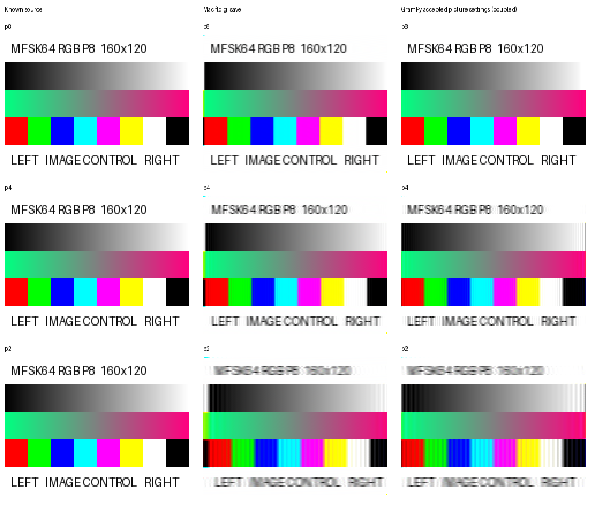

# Session 9 route to encoder qualification

**Superseded closeout route:** PM subsequently directs a practical large-image
qualification under D-027 and the separately frozen
[v3 matrix](../mfsk_encoder_pi_matrix_v3.json). Tiny-image diagnosis and fresh
fldigi transmitter calibration are no longer prerequisites. The numerical
engineering screen is frozen before the new outputs; PM then reviews the
pictures visually. The investigation and proposal below remain historical
evidence, rather than instructions governing the new run.

**User direction, 2026-10-02:** replace decoded-picture bit perfection with a
sensible scorecard-based requirement, while independently diagnosing the severe
tiny-picture failures. This confirms the replacement principle, not a numerical
tolerance or an encoder qualification result. Original failures and artifacts
remain immutable evidence.

## Revised acceptance structure

| Area | Proposed qualification rule | Status |
| --- | --- | --- |
| Transmitted signal and protocol | Retain exact source-derived component order, frequency, duration, phase, framing, RSID, coordinate/frame-count and mutation checks. | Existing checks remain. |
| Picture recovery | Require correct identity/order, header, dimensions and end-of-picture recovery; retain following-text and whole-WAV mode-acquisition gates. Report omitted receiver components and collection failures explicitly. | Existing functional checks remain; pixels need a new gate. |
| Decoded raster quality | Use the existing scorecard: raw and aligned MAE, RMSE, channel bias, PSNR and required alignment compensation. Exact equality remains a reported diagnostic rather than the sole picture pass/fail requirement. Score each mode, speed and fixture separately. | Replacement principle confirmed; calibrated numerical limits remain to be proposed. |
| Visible defects | Candidate-set visual review must reject unexplained blank/missing regions, wrong colour planes, slant or structured artifacts even when an aggregate or aligned score looks good. Retain raw output and alignment burden. | Required safeguard; no automatic acceptance of reference defects. |
| Reference and measurement validity | Compare native and fresh fldigi transmissions of the same source through the same pinned receiver, with nominal recorded timing, completed-picture collection and repeatability measurements. Keep independent Mac evidence. | Fresh transmitter/capture path still needs validation. |

The proposed numerical policy is **per-case native quality no worse than the
calibrated reference outside measured repeatability**, with raw quality,
aligned quality and alignment burden assessed separately. At least three p8
reference replays should establish collection and receive variability before
extending the baseline to the other retained mode/speed combinations. The
exact margin and whether reference generation itself is repeatable must be
published before applying the gate. Do not choose a margin from the candidate's
failed scores, import historical shortwave-corpus thresholds, or accept a
substantively broken reference picture just because both transmitters fail.

Known reference limitations may need an explicit compatibility decision after
diagnosis. They must not be hidden by adding transmitter pixels, changing
native frequency order, dropping the tiny fixtures, or widening a tolerance.
Any supported-image-size change would be a separate PM scope decision.

## Tiny-picture hypotheses and discriminating tests

| Hypothesis | Evidence and confidence | Cheapest test | Remediation if confirmed |
| --- | --- | --- | --- |
| H1: receiver filtering cannot follow the tiny fixture's rapid colour changes without mixing adjacent values/planes. | High confidence that this mechanism creates error: the source-derived filter model retains error at nominal delay, and wider repeated blocks reduce it. Medium confidence about its contribution to every live failure. | Original 8×4 versus uniform 8×4; equal-duration 8×120 versus 240×4. All use p8, the same encoder, carrier and original pixel values. | Treat demonstrated receiver loss separately from encoder validity. Investigate receiver handling only if it exceeds the calibrated reference or prevents the required interoperability; any reference replacement gets a new explicit identity. |
| H2: picture-entry timing shifts the received component sequence, amplified by very narrow colour planes. | Strong explanatory evidence: earlier whole-WAV completed interiors match a source-derived model to MAE below one with effective timing offsets; offsets are fitted, and the origin in trigger/resampler/filter timing remains unresolved. | Measure actual picture-entry/component timing in a receiver sidecar and compare it with the known waveform epoch, independently of image truth. Vary width while holding duration equal; compare fresh fldigi/native headers under identical reception. | Correct the implicated trigger/collector/reference stage. Change encoder framing or prologue only if independent evidence identifies a native profile defect. |
| H3: queued GUI updates race direct autosaving, particularly during a very short picture. | Confirmed contributor on Pi: unreadable initial geometry, missing updates and grayscale saves equal to the previous picture. It is insufficient by itself because completed Pi buffers remain distorted. Mac completed buffers are not yet captured. | Capture settled viewer pixels and autosave from the same run for all four controls; the wide/tall pair has equal duration. | Correct qualification collection to bind the actual completed picture to its announcement. Preserve and separately classify fldigi autosave failures; do not patch the encoder to compensate. |
| H4: picture-entry state and the final-component omission cause endpoint corruption. | Final omitted component is confirmed in retained source and all seven completed tiny buffers. Initial-state contribution remains unresolved. Endpoint loss alone cannot explain wholesale colour/content distortion. | Inspect the uniform control's first/interior/last components and receiver state. Quantify endpoint errors separately from the interior. | Fix or explicitly classify the receiver lifecycle behavior after its impact is established; retain an independent reference identity if patched. |
| H5: a native encoder order/frequency/duration/framing defect remains. | Low support for a raster defect: all seven retained raster recipes match PCM rounding precision and reject deliberate mutations. That does not independently settle every live picture-trigger/profile behavior. | Fresh same-source fldigi/native pair plus waveform and entry-timing comparison; failures unique to native determine the next targeted check. | A focused encoder correction followed by local/mutation evidence and the affected full qualification matrix, if the defect is demonstrated. |

These hypotheses can coexist. H3 is already a demonstrated collection fault;
the open question is what explains distortion in completed receiver pixels.
H1 and H2 are the leading explanations for that separate loss.
See [the filtering explanation and matched Mac/Pi evidence](filtering-and-receive-paths.md):
manual reception does not universally remove tiny-image failures, nor are the
paths pixel-equivalent. Different builds/audio paths and asymmetric viewer/save
collection limit causal attribution to the harness.

## New controls and results

The [44.25975-second WAV](/Users/sam/vcs/GramPy/.local/session9/tiny-hypothesis-controls/grampy-tiny-width-duration-p8.wav)
is generated by the unchanged encoder. It carries four labelled MFSK64 RGB p8
pictures at 1500 Hz, in this order:

| Control | Geometry | Payload time | What it tests |
| --- | --- | ---: | --- |
| Original | 8×4 | 0.096 s | Reproduce the original high-contrast fixture. |
| Constant | 8×4 | 0.096 s | Same tiny geometry and duration, but all RGB values are 128. |
| Tall | 8×120 | 2.880 s | Repeat original rows 30 times: much longer total duration, same narrow planes and rapid changes. |
| Wide | 240×4 | 2.880 s | Repeat each original pixel 30 times horizontally: equal duration/pixel count to Tall, wider planes and slower colour changes. |

These are explicit additional source images, not encoder resizing or
replacement acceptance fixtures. Width and transition spacing change together;
the pair discriminates their combined influence from total duration but does
not independently separate those two mechanisms. Caller labels identify each
picture. Use the same known manual playback path, fixed MFSK64/1500 Hz with
RxID/AFC off, complete playback and the completed viewer as well as its save.

The source-derived receiver model predicts the following mean component errors
on the 0–255 scale. **These are simulations, not observed fldigi reception.**
The offsets were declared in advance; nominal uses the model's 83-sample
internal filter delay, without fitting to source pixels.

| Control | Nominal model timing MAE | Eight internal samples earlier MAE |
| --- | ---: | ---: |
| Original | 15.313 | 77.406 |
| Constant | 0.906 | 1.938 |
| Tall | 15.181 | 78.598 |
| Wide | 0.958 | 3.225 |

Merely making this source taller does not materially improve predicted error;
spreading its transitions horizontally does. Small timing shifts strongly
increase the narrow controls' error but affect the wide control much less.
This supports H1/H2 and supplies a concrete live prediction. The model omits
live resampling, acquisition/trigger latency, GUI concurrency, entry-state and
final-component bugs. A successful wide image alone will not close H3/H4.

All four new prologue/raster waveforms match source-derived order/frequencies/
widths with maximum residual 0.492–0.502 signed-PCM units. This new fit holds
the specified amplitude 16384 fixed and fits only initial phase; an initial
attempt using unconstrained amplitude was biased by periodic constant-tone
rounding noise. Both attempts are retained. [The manifest](tiny-hypothesis-controls.json)
records hashes, coordinates, predictions and limitations; [generation/model
execution](tiny-hypothesis-controls-result.md) completed in two seconds and
verified all 40 retained production hashes.

## Corrected GramPy scorecard evidence

The earlier low-level FFT/default-filter comparison is retained as a historical
diagnostic. A new [scorecard](accepted-scorecard.json) uses the accepted picture
settings: `bounded_correlation`, `full_hann`, `response_matched`, `unified_grid`,
and recovered text-clock/bit evidence. It covers all seven original tiny
pictures and all three normal-sized native chart WAVs. Existing raw-raster and
bounded-alignment scoring functions are used directly.

| MFSK64 RGB | GramPy original 8×4 raw MAE | GramPy 160×120 raw MAE | Mac 8×4 save raw MAE | Mac 160×120 save raw MAE |
| --- | ---: | ---: | ---: | ---: |
| p8 | 0.438 | 0.621 | 87.802 | 13.697 |
| p4 | 3.729 | 7.273 | 113.177 | 16.214 |
| p2 | 14.375 | 11.290 | 97.771 | 22.059 |

GramPy's accepted-settings diagnostic remains non-exact and shows speed-related
blur. The previous percentages must not be presented as accepted-settings
figures. This is still a coupled known-segment/mode/carrier analytic-WAV
diagnostic, not the full production IQ pipeline or independent encoder
qualification. GramPy aligned scores here select zero compensation; the full
record retains compensation for the Mac comparison separately. The managed
[run completed in 15 seconds](accepted-scorecard-result.md), with all 40
production hashes unchanged.

## Bounded path to close Session 9

1. Record the confirmed replacement principle and prepare the calibrated
   numerical scorecard policy as a separate version; preserve Session 8's
   original manifest and scoring results.
2. Receive the four ready controls, bind each completed viewer/save to its
   label, and test H1/H2 against their stated predictions. Use the constant
   control and existing source observations to quantify H3/H4 separately.
3. Establish the fresh same-source fldigi reference and entry-timing evidence.
   Resolve the identified collection/timing stage or make a concrete PM scope/
   reference decision if a pinned-receiver limitation prevents qualification.
   An offline-corrected reference recording is explanatory, not the final gate.
4. Freeze numerical limits and the collection method before evaluating the
   unchanged or corrected candidate. Run the original whole-WAV matrix with
   original tiny fixtures plus representative normal-sized controls, retaining
   all per-case results and visual review. Run focused and broader regression
   checks only as required by any implementation change.
5. Close only on qualification against that versioned gate or an explicit
   reject/defer decision. A good normal-sized chart or a changed equality rule
   alone does not qualify the encoder.

The immediate live test is concrete and ready. No encoder or decoder production
change is indicated solely by these diagnostic scores or model predictions.
